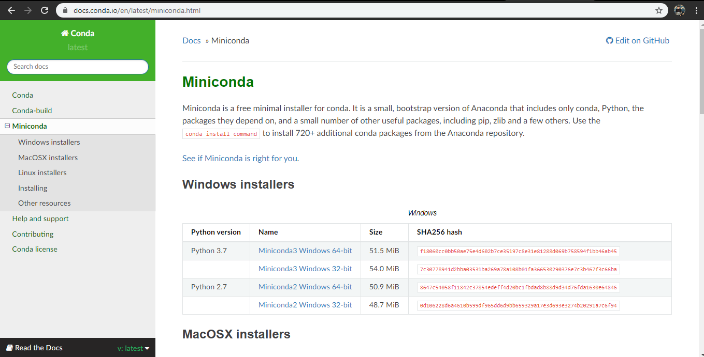

# python_dataviz
# นายทรงกลด อาจปา
# 603021864-1 SC-SI
## Miniconda
1. ทำการดาวน์โหลด Miniconda ลงเครื่อง

2. เปิดโปรแกรม Anaconda Prompt

3. install mathplotlib โดยใช้คำสั่ง > conda install mathplotlib 

4. install jupyter โดยใช้คำสั่ง > conda install jupyter

## Google colab
1. sign in เพื่อเข้าใช้ Google colab >> คลิก new python3 notebook >> เปลี่ยนชื่อไฟล์ ex. Day1test.ipynb

2. ไปที่ File >> Downlond.ipynb เพื่อดาวน์โหลดลงเครื่องคอมพิวเตอร์ไปยังโฟลเดอร์ที่เราต้องการจัดเก็บ

## Github
1. https://github.com/
สมัครเข้าใช้งาน >> sign up เพื่อทำการสมัครสมาชิก

2. ไปที่ New repository >> Reposeitory (ตั้งชื่องาน) >> Initialize this repository with a README >> Create repository

3. ไปที่ Clone or download >> คัดลอก URL

4. Install git  โดยใช้คำสั่ง > conda install -c anaconda git

5. Clone git โดยใช้คำสั่ง > git clone ตามด้วย URL ที่เราคัดลอกมา

6. ใช้คำสั่ง > dir เพื่อตรวจสอบว่ามี file ใดบ้าง

7. ใช้คำสั่ง > git status เพื่อตรวจสอบว่ามี file ใดที่ยังไม่ได้เชื่อมต่อกับอินเตอร์เน็ต

8. ใช้คำสั่ง > git add  เพื่อ add file ที่ต้องการเชื่อมต่อกับอินเตอร์เน็ต

9. git commit โดยใช้คำสั่ง > git commit -m “test git” 

10. ใช้คำสั่ง > git push เพื่ออัปโหลด file เข้าไปที่เว็บไซต์ github โดยต้องทำการกรอก UserName และ Password เสมอ

## Visual Studio Code
1. ทำการดาวน์โหลดโปรแกรม Visual Studio Code

2. เปิดใช้งานโปรแกรม  Visual Studio Code ผ่าน Anaconda โดยใช้คำสั่ง >> code.

